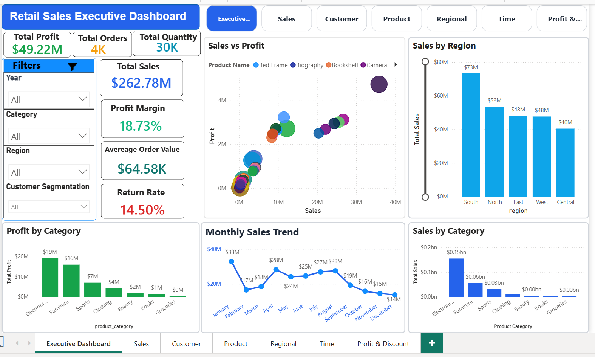
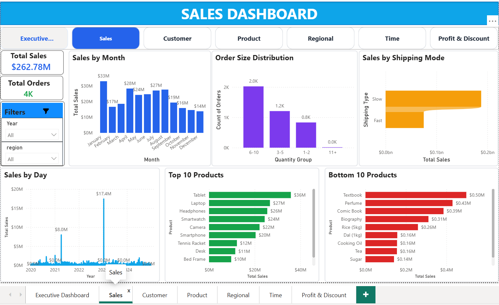
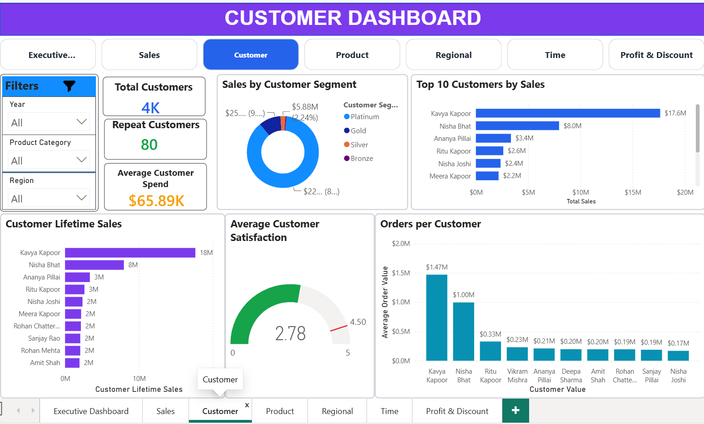
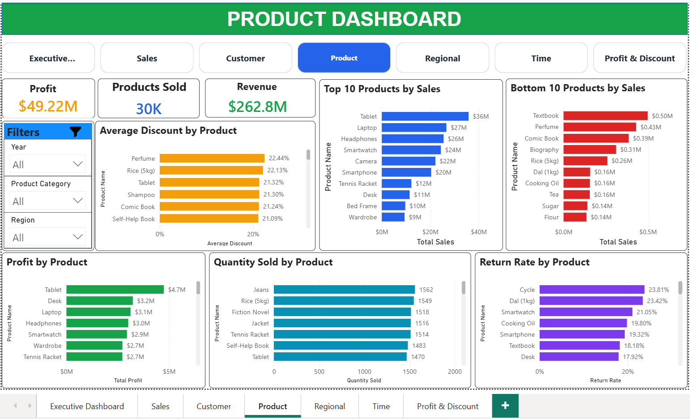
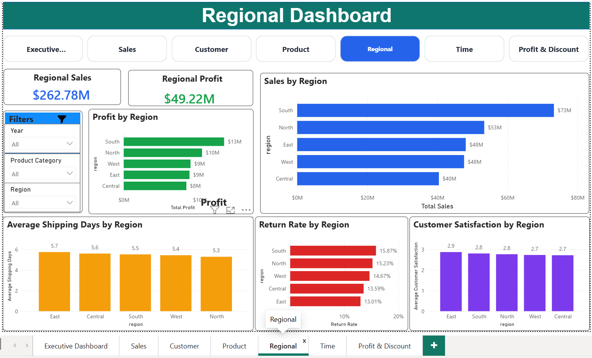
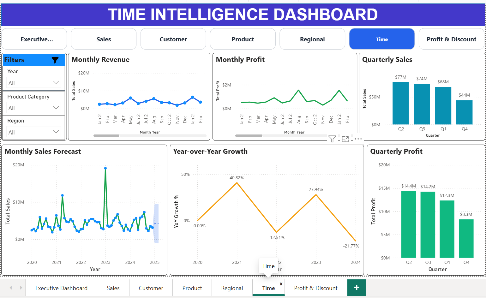
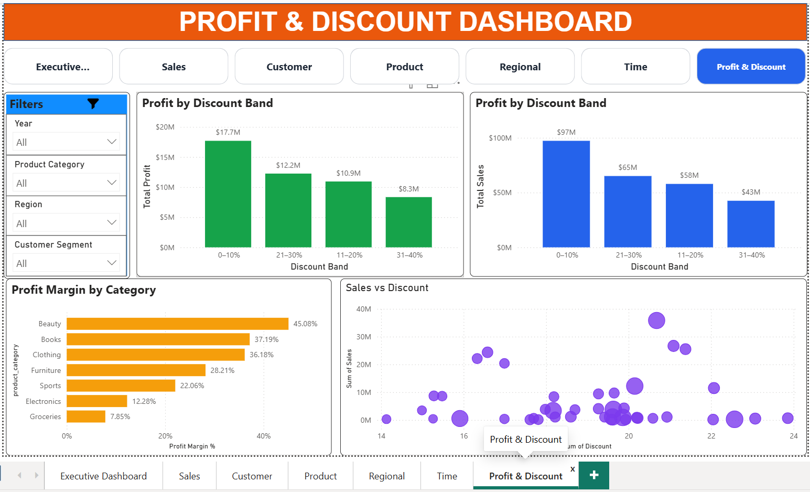

# 📊 SuperStore Sales Analytics

## 1. Project Overview

The **SuperStore Sales Analytics** project is an end-to-end Data Analytics solution that demonstrates the complete analytics lifecycle followed in modern organizations. The project transforms raw retail sales data into actionable business insights using **SQL, Python, and Power BI**.

The workflow includes data ingestion, SQL-based data cleaning, exploratory data analysis, feature engineering, dashboard development and business recommendations. The final deliverable is an interactive Power BI dashboard designed to support executive decision-making.

---

# 2. Business Problem

Retail businesses generate thousands of transactions daily, making it difficult to identify trends, monitor performance and make informed decisions using raw data alone.

The company needs an analytics solution to answer questions such as:

* Which products generate the highest revenue and profit?
* Which customers contribute the most value?
* Which regions perform the best?
* How do discounts affect profitability?
* What are the monthly and yearly sales trends?
* Which business areas require improvement?

---

# 3. Objectives

The primary objectives of this project are:

* Clean and validate raw retail sales data.
* Build an industry-standard SQL ETL pipeline.
* Perform exploratory data analysis using Python.
* Engineer meaningful business features.
* Develop an interactive Power BI dashboard.
* Generate business insights and recommendations.
* Demonstrate end-to-end Data Analytics skills suitable for Data Analyst roles.

---

# 4. Dataset

**Dataset Name:** `retail_sales_dataset.csv`

The dataset contains retail transaction records including:

* Order Details
* Customer Information
* Product Information
* Regional Information
* Shipping Information
* Sales
* Profit
* Discounts
* Customer Satisfaction
* Returns

The raw dataset is cleaned and transformed into an analytics-ready dataset for reporting.

---

# 5. Tools Used

| Tool             | Purpose                                             |
| ---------------- | --------------------------------------------------- |
| SQL (MySQL)      | Database creation, ETL, cleaning, business analysis |
| Python           | Data validation, EDA, feature engineering           |
| Pandas           | Data manipulation                                   |
| NumPy            | Numerical computations                              |
| Matplotlib       | Data visualization                                  |
| Seaborn          | Statistical visualization                           |
| Power BI         | Interactive dashboard development                   |
| Git & GitHub     | Version control and portfolio                       |
| Jupyter Notebook | Python analysis                                     |

---

# 6. Architecture

```
Raw CSV Dataset
        │
        ▼
MySQL Database
        │
        ▼
Data Cleaning & Validation
        │
        ▼
Business SQL Analysis
        │
        ▼
Export Clean Dataset
        │
        ▼
Python Data Validation
        │
        ▼
Exploratory Data Analysis
        │
        ▼
Feature Engineering
        │
        ▼
Final Analytics Dataset
        │
        ▼
Power BI Dashboard
        │
        ▼
Business Insights & Recommendations
```

---

# 7. Workflow

### Phase 1

* Project Understanding

### Phase 2

* SQL Database Design

### Phase 3

* Raw Data Import

### Phase 4

* SQL Data Cleaning

### Phase 5

* Business SQL Analysis

  * Executive KPIs
  * Sales Analysis
  * Profit Analysis
  * Customer Analysis
  * Product Analysis
  * Regional Analysis
  * Discount Analysis
  * Time Intelligence
  * Window Functions
  * CTEs
  * Views
  * Query Optimization

### Phase 6

* Python Data Validation
* Exploratory Data Analysis
* Feature Engineering

### Phase 7

* Power BI Dashboard

### Phase 8

* Business Recommendations

---

# 8. SQL Work

The SQL phase follows an industry-standard ETL workflow.

### Database Design

* Database Creation
* Data Types
* Constraints
* Indexes

### Data Cleaning

* Removed duplicates
* Handled NULL values
* Standardized text
* Validated numeric fields
* Cleaned date columns
* Business rule validation

### Business Analysis

More than **140 SQL queries** covering:

* Executive KPIs
* Sales Analysis
* Profit Analysis
* Customer Analytics
* Product Analytics
* Category Analytics
* Regional Analytics
* Shipping Analytics
* Discount Analytics
* Time Intelligence
* Window Functions
* CTEs
* Views
* Query Optimization
* Stored Procedures

---

# 9. Python Work

Python was used for advanced analytics after SQL cleaning.

### Data Validation

* Missing Value Analysis
* Duplicate Check
* Data Type Validation
* Summary Statistics
* Data Consistency

### Exploratory Data Analysis

* Sales Distribution
* Profit Distribution
* Category Analysis
* Customer Analysis
* Product Analysis
* Regional Analysis
* Correlation Analysis
* Time Series Analysis
* Outlier Detection

### Feature Engineering

Created business features including:

* Profit Margin %
* Discount Band
* Customer Segment
* Customer Lifetime Sales
* Customer Order Count
* Shipping Performance
* Order Size
* High Value Orders
* Satisfaction Level
* Time Features

---

# 10. Power BI Dashboard

The Power BI report contains **7 interactive pages**:

### Executive Dashboard

* KPI Cards
* Monthly Sales Trend
* Category Performance
* Regional Performance

### Sales Dashboard

* Sales Trends
* Top Products
* Sales Distribution

### Customer Dashboard

* Customer Segmentation
* Top Customers
* Customer Lifetime Sales

### Product Dashboard

* Product Performance
* Profitability
* Return Analysis

### Regional Dashboard

* Regional Sales
* Regional Profit
* Customer Satisfaction

### Time Intelligence Dashboard

* Monthly Trends
* Quarterly Trends
* Yearly Trends

### Profit & Discount Dashboard

* Profit Margin
* Discount Analysis
* Loss-Making Orders

Features include:

* Interactive Filters
* Dynamic KPIs
* Drill Through
* Navigation Buttons
* Conditional Formatting
* Tooltips
* DAX Measures

---

# 11. Business Insights

Key insights generated from the analysis include:

* Technology products generated the highest profit.
* High discounts negatively impacted profit margins.
* A small percentage of customers contributed a large share of revenue.
* Certain regions consistently outperformed others in both sales and profitability.
* Monthly sales displayed seasonal trends.
* Shipping costs influenced overall profitability.
* Some products generated high revenue but low profit.
* Customer segmentation revealed valuable repeat customers.

---

# 12. Folder Structure

```
SuperStore-Analytics/
│
├── 01_data/
│   └── retail_sales_final.csv
│
├── 02_sql/
│   ├── 00_data_quality_checks.sql
│   ├── 01_database_creation.sql
│   ├── 02_data_cleaning.sql
│   ├── 02a_post_cleaning_validation.sql
│   ├── 03_business_queries.sql
│   ├── 04_window_functions.sql
│   ├── 05_ctes.sql
│   ├── 06_subqueries.sql
│   ├── 07_views.sql
│   ├── 08_query_optimization.sql
│   ├── 09_indexes.sql
│   └── 10_stored_procedures.sql
│
├── 03_python/
│   ├── 01_data_validation.ipynb
│   ├── 02_eda.ipynb
│   └── 03_feature_engineering.ipynb
│
├── 04_power bi/
│   └── SuperStore_Analytics.pbix
│
├── images/
│
├── DATA_DICTIONARY.md
├── business_insights.md
├── README.md
├── requirements.txt
├── LICENSE
└── .gitignore
```

---

# 13. Dashboard Screenshots
images/

<h3 align="center">Executive Dashboard</h3>
<p align="center">
  
</p>


<h3 align="center">Sales Dashboard</h3>
<p align="center">
  
</p>


<h3 align="center">Customer Dashboard</h3>
<p align="center">
  
</p>


<h3 align="center">Product Dashboard</h3>
<p align="center">
  
</p>


<h3 align="center">Regional Dashboard</h3>
<p align="center">
  
</p>


<h3 align="center">Time Intelligence Dashboard</h3>
<p align="center">
  
</p>


<h3 align="center">Profit Dashboard</h3>
<p align="center">
  
</p>


---

# 14. Installation

Clone the repository:

```bash
git clone https://github.com/varun_pathania-1/SuperStore-Analytics.git
```

Navigate to the project folder:

```bash
cd SuperStore-Analytics
```

Install Python Dependencies
```bash
pip install -r requirements.txt
```

## Open the Project:

### SQL

Open the SQL scripts from:
```
02_sql/
```
Use MySQL Workbench to execute the SQL workflow.

### Python

Open the notebooks from:
```
03_python/
```
Use Jupyter Notebook to run the Python analysis.

### Power BI

Open:
```
04_power bi/SuperStore_Analytics.pbix
```
using Power BI Desktop.

---

# 15. Future Improvements

Future enhancements include:

* Real-time data integration
* Automated ETL pipelines
* Sales forecasting using Machine Learning
* Customer churn prediction
* Inventory optimization
* Cloud deployment using Azure or AWS
* Interactive web dashboard using Streamlit
* Scheduled Power BI refresh

---

# 16. Resume Highlights

* Designed and implemented an end-to-end retail sales analytics solution using SQL, Python, and Power BI.
* Developed an enterprise-style SQL ETL pipeline including data cleaning, validation, indexing, CTEs, window functions, views, and query optimization.
* Performed exploratory data analysis and feature engineering using Pandas, NumPy, Matplotlib, and Seaborn.
* Built a 7-page interactive Power BI dashboard with DAX measures, drill-through, slicers, navigation buttons, and executive KPIs.
* Generated actionable business insights on customer behavior, product performance, regional sales, profitability, shipping, and discount analysis.
* Applied industry-standard analytics workflow from raw data ingestion to executive-level reporting.

---

# ⭐ Skills Demonstrated

## Analytics:
SQL • Data Cleaning • ETL • Data Validation • EDA • Feature Engineering • Business Analytics • Data Storytelling

## Programming & Data:
Python • Pandas • NumPy • Matplotlib • Seaborn

## Business Intelligence:
Power BI • DAX • Dashboard Development

## Database:
MySQL

## Tools:
Jupyter Notebook • Git • GitHub

---

## Author

### Varun Pathania

Computer Science & Engineering — Data Science
